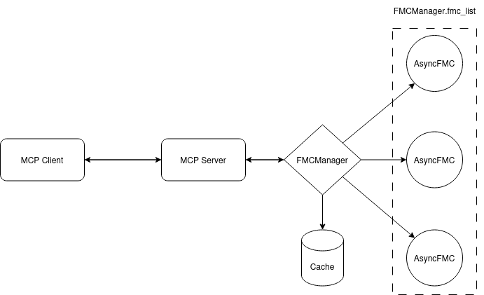

# secure-firewall-mcp

## Overview 
A client requested for this to be built to enable their AI agent whilst waiting for [Cisco AI Canvas](https://newsroom.cisco.com/c/r/newsroom/en/us/a/y2025/m06/announcing-cisco-ai-canvas-revolutionizing-it-with-agenticops.html). I was overcome by open source thoughts and couldn't resist...

An MCP server for interfacing with the Cisco Secure Firewall API. 

Tested on Cisco Secure Firewall version 7.6.2, and capable of gathering the following:
- Devices - by name, all
- HA pairs (by name, all)
- Health alerts (by FMC)
- Audit alerts (Incomplete: need to implement second audit log endpoint)
- Job history (by FMC)
- User

### Software Architecture


MCP server uses FMCManager to select and consume AsyncFMC objects for operations, cache is populated at start of runtime to aid with AsyncFMC selection and reduce total API requests. Cache is just a hashmap of DataFrames for now, could be expanded out to Redis in the future.

## Usage
### Installation
``` bash
git clone https://github.com/yoxxa/secure-firewall-mcp
cd secure-firewall-mcp
```

### Prerequisites
- Set service account credentials in `src/creds/.env`
    ``` bash 
    FMC_USERNAME=admin
    FMC_PASSWORD=firewall123 
    ```
- Configure `fmc_hosts.yaml` with FMC's to send requests
    ``` yaml
    hosts:
    - https://192.168.1.1
    - https://fmc-dc.test.com
    ```

### Deployment
``` bash
docker compose up --build
```

## Testing
TODO: need to modularise testing to enable more dynamic parameterisation.

Testing covers two aspects of the codebase:
- The end-to-end MCP client calls to the primary MCP server
- The SDK calls using an AsyncFMC object

#### Prerequisite
- Set an FMC to use for AsyncFMC SDK testing in `src/creds/.env`
    ``` bash 
    FMC_HOST=https://192.168.1.1
    ```

``` bash
python3 -m pytest tests
```